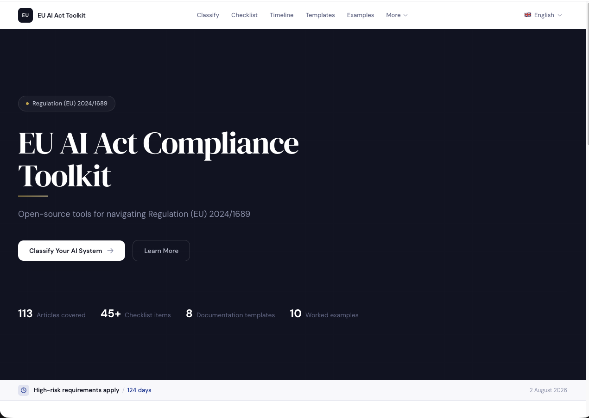
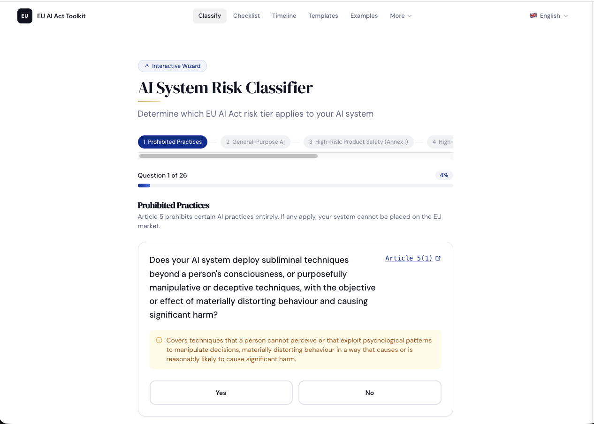
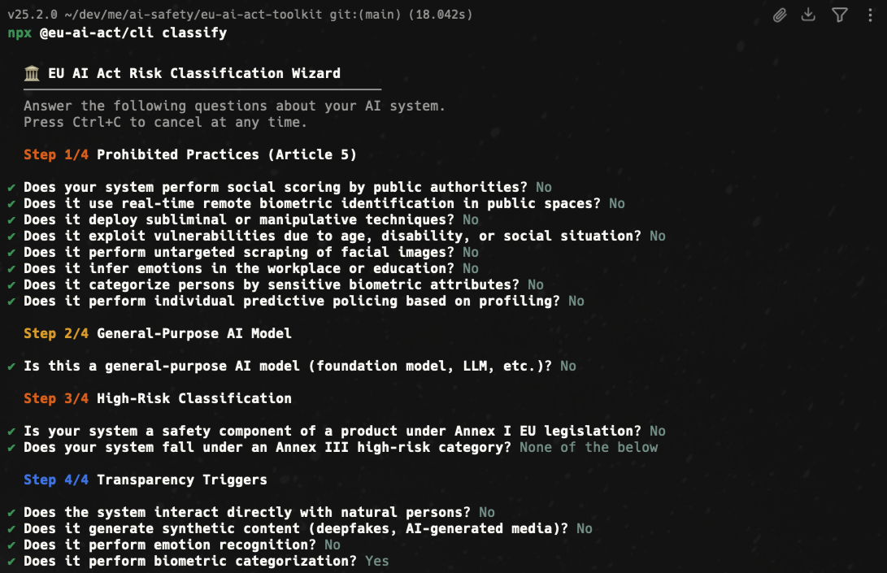
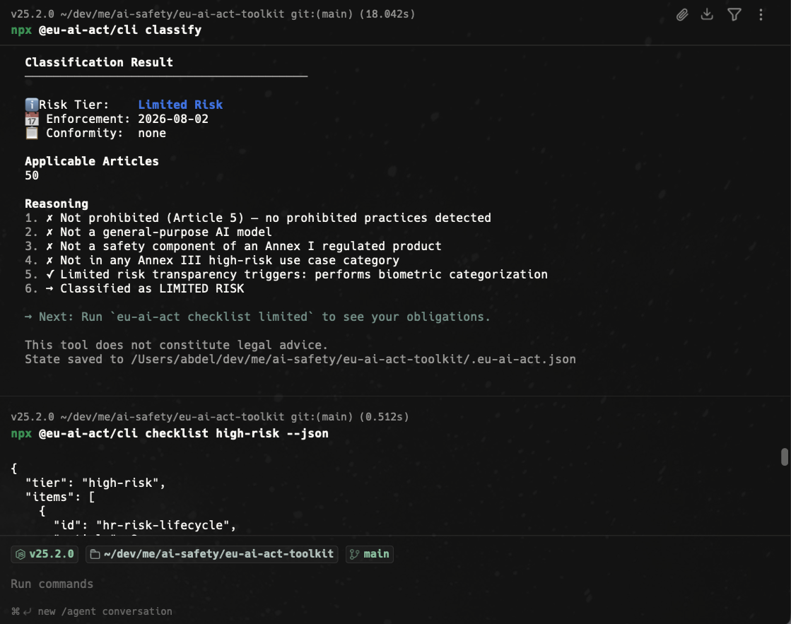

<p align="center">
  <h1 align="center">EU AI Act Toolkit</h1>
  <p align="center">
    Classify AI systems, track obligations, and generate compliance docs for <a href="https://artificialintelligenceact.eu/">Regulation (EU) 2024/1689</a> — entirely open-source.
  </p>
</p>

<p align="center">
  <a href="https://github.com/AbdelStark/eu-ai-act-toolkit/actions"></a>
  <a href="https://www.npmjs.com/package/@eu-ai-act/sdk"></a>
  <a href="https://www.npmjs.com/package/@eu-ai-act/cli"></a>
  
  <a href="https://github.com/AbdelStark/eu-ai-act-toolkit/blob/main/LICENSE"></a>
</p>

<table>
  <tr>
    <td align="center"><br /><sub>Classification wizard</sub></td>
    <td align="center"><br /><sub>Compliance dashboard</sub></td>
  </tr>
  <tr>
    <td align="center"><br /><sub>Interactive CLI</sub></td>
    <td align="center"><br /><sub>Checklist tracking</sub></td>
  </tr>
</table>

---

## Architecture

```
eu-ai-act-toolkit/
├── data/                 ← Single source of truth (JSON + JSON Schema)
│   ├── questions.json    ← Classification decision tree (26 questions, 5 steps)
│   ├── checklists.json   ← All checklist items with article references
│   ├── timeline.json     ← Enforcement dates
│   ├── articles.json     ← Article text and cross-references
│   ├── annexes.json      ← Annex III categories
│   ├── examples.json     ← 10 worked classification examples
│   ├── penalties.json    ← Article 99 penalty tiers
│   ├── standards.json    ← Harmonised standards mapping
│   └── schema/           ← JSON Schema validation
├── packages/
│   ├── sdk/              ← @eu-ai-act/sdk — pure TypeScript, zero deps
│   ├── cli/              ← @eu-ai-act/cli — Commander.js + Inquirer
│   └── web/              ← Next.js 14, next-intl (14 languages), Radix UI
├── locales/              ← i18n translation strings
└── docs/                 ← Static compliance documents
```

Three packages, one data layer. All components consume the same `data/` directory — updating the regulation means editing JSON, not code.

| Package | What it does |
|---------|-------------|
| [`@eu-ai-act/sdk`](packages/sdk/) | Pure TypeScript library. Zero runtime deps. Classification engine, checklists, templates, timeline. |
| [`@eu-ai-act/cli`](packages/cli/) | Interactive terminal tool. Classify, checklist, timeline, penalties, gaps, standards, reports. |
| [Web App](packages/web/) | Static Next.js dashboard. Everything client-side — no backend, no accounts, no data leaves your browser. |

## Quick Start

### 1. Classify your AI system (no install)

```bash
npx @eu-ai-act/cli classify
```

Walks you through the Act's decision tree and outputs your risk tier, applicable articles, and enforcement deadline.

### 2. See what you need to do

```bash
npx @eu-ai-act/cli checklist high-risk
```

Returns all obligations for a given tier, each citing the specific EU AI Act article.

### 3. Generate compliance docs

```bash
npx @eu-ai-act/cli generate --tier high-risk --system "My AI System" --provider "Acme Corp" --purpose "Hiring"
```

Outputs pre-structured Markdown templates (technical docs, risk management, data governance, human oversight, and more) with `[TODO]` placeholders.

## SDK Usage

```bash
npm install @eu-ai-act/sdk
```

```typescript
import { classify, getChecklist, getTimeline } from '@eu-ai-act/sdk';

// One function call → know your obligations
const result = classify({
  subliminalManipulation: false,
  exploitsVulnerabilities: false,
  socialScoring: false,
  predictivePolicing: false,
  untargetedFacialScraping: false,
  emotionInferenceWorkplace: false,
  biometricCategorization: false,
  realtimeBiometrics: false,
  isGPAI: false,
  annexIProduct: false,
  annexIIICategory: 'employment',
  interactsWithPersons: true,
  generatesSyntheticContent: false,
  emotionRecognition: false,
  biometricCategorizing: false,
});

result.tier;                // 'high-risk'
result.articles;            // [6, 9, 10, 11, 12, 13, 14, 15, 16, 17, 26, 27, 43, 49]
result.conformityAssessment // 'self'
result.enforcementDate;     // '2026-08-02'
result.reasoning;           // Step-by-step explanation

// Get the full checklist for that tier
const checklist = getChecklist(result.tier);

// Get enforcement timeline with countdowns
const timeline = getTimeline();
```

All functions are **pure and deterministic** — same input, same output, no side effects.

### SDK API

| Function | Signature | Description |
|----------|-----------|-------------|
| `classify` | `ClassificationInput → ClassificationResult` | Risk classification following Article 5 → GPAI → Annex I/III → limited → minimal precedence |
| `getChecklist` | `RiskTier → ChecklistItem[]` | All obligations for a tier, each citing a specific Article |
| `getTimeline` | `Date? → TimelineEvent[]` | Enforcement milestones with status relative to reference date |
| `generateTemplate` | `(TemplateName, TemplateInput) → string` | Markdown compliance doc (8 templates: tech docs, risk mgmt, data governance, etc.) |
| `getQuestions` | `() → QuestionStep[]` | Decision tree for building classification wizards |
| `calculateScore` | `(ChecklistItem[], Progress) → number` | Compliance score (0–100) from checklist progress |
| `buildReasoning` | `ClassificationResult → string` | Human-readable reasoning chain |

## CLI Commands

```bash
npx @eu-ai-act/cli <command>
```

| Command | Description |
|---------|-------------|
| `classify` | Interactive risk classification wizard |
| `checklist <tier>` | Compliance obligations for a risk tier |
| `timeline` | Enforcement dates and countdowns |
| `penalties <tier>` | Maximum fine exposure (Art. 99) |
| `gaps <tier>` | Compliance gap analysis with priority scoring |
| `standards` | Harmonised standards mapping (ISO, CEN/CENELEC) |
| `report` | Full compliance report (`--format md` or `--format json`) |
| `templates` | List available documentation templates |
| `generate` | Generate compliance documentation |
| `examples` | Worked classification walkthroughs (10 scenarios) |
| `articles` | Browse EU AI Act articles |
| `annexes` | Browse Annex III categories |

All commands support `--json` for machine-readable output.

## Risk Tiers

The Act classifies AI systems into six tiers. Obligations scale with risk.

| Tier | Obligations | Key Articles | Enforcement |
|------|-------------|-------------|-------------|
| **Prohibited** | Must not be deployed | Art. 5 | Feb 2, 2025 |
| **High-Risk** | 61 checklist items (risk mgmt, data governance, docs, human oversight, accuracy) | Art. 6–15, 43, 72–73 | Aug 2, 2026 |
| **GPAI Systemic** | Evaluations, adversarial testing, incident reporting, cybersecurity | Art. 51–55 | Aug 2, 2025 |
| **GPAI** | Technical docs, copyright compliance, training data summary | Art. 51–53 | Aug 2, 2025 |
| **Limited** | Transparency: disclose AI interaction, label synthetic content | Art. 50 | Aug 2, 2026 |
| **Minimal** | Voluntary codes only | — | Aug 2, 2026 |

Penalties: up to **35M EUR** or **7% of global turnover**.

## Agent Integration

### Install as agent skills (recommended)

```bash
npx skills add AbdelStark/eu-ai-act-toolkit
```

Installs 3 skills (`classify-ai-system`, `compliance-checklist`, `generate-compliance-docs`) compatible with Claude Code, Cursor, Copilot, Codex, Windsurf, and [40+ agents](https://github.com/vercel-labs/skills#supported-agents).

### Claude Code slash commands

Clone this repo and these commands are available automatically:

```
/classify          # Classify an AI system's risk tier
/checklist         # Show compliance checklist for a tier
/generate-docs     # Generate compliance documentation
```

### Programmatic agent use

```bash
npx @eu-ai-act/cli classify --annex-iii employment --json   # Quick classification
npx @eu-ai-act/cli checklist high-risk --json                # Obligations as JSON
npx @eu-ai-act/cli gaps high-risk --json                     # Gap analysis as JSON
```

## Development

```bash
git clone https://github.com/AbdelStark/eu-ai-act-toolkit.git
cd eu-ai-act-toolkit
npm install
npx turbo build    # Build SDK → CLI → Web
npx turbo test     # Vitest (SDK) + Playwright (Web)
npx turbo dev      # Dev server on localhost:3000
```

Monorepo with [Turborepo](https://turbo.build/). SDK builds with [tsup](https://tsup.egoist.dev/) (ESM + CJS). Web app is [Next.js 14](https://nextjs.org/) with [Tailwind CSS](https://tailwindcss.com/).

## Documentation

| Document | Description |
|----------|-------------|
| [SDK README](packages/sdk/README.md) | Full API reference and integration guide |
| [CLI README](packages/cli/README.md) | All commands, flags, and usage patterns |
| [AGENTS.md](AGENTS.md) | Architecture and conventions for AI coding agents |
| [CONTRIBUTING.md](CONTRIBUTING.md) | Development setup and contribution guidelines |

## Contributing

Contributions welcome. See [CONTRIBUTING.md](CONTRIBUTING.md). High-impact areas:

- **Legal corrections** — cite the Article
- **Translation review** — 14 languages need native speaker verification
- **Standards mapping** — track CEN/CENELEC JTC 21 publications
- **Edge case examples** — classification walkthroughs for ambiguous scenarios

## Disclaimer

This toolkit helps organize and track compliance work. It does not constitute legal advice. Consult qualified legal counsel for compliance decisions. Not affiliated with the European Union or any EU institution.

## References

- [EU AI Act Full Text](https://artificialintelligenceact.eu/ai-act-explorer/) · [EUR-Lex](https://eur-lex.europa.eu/eli/reg/2024/1689/oj) · [EU AI Office](https://digital-strategy.ec.europa.eu/en/policies/ai-office) · [NIST AI RMF](https://airc.nist.gov/) · [ISO/IEC 42001](https://www.iso.org/standard/81230.html)

## License

[MIT](LICENSE)
